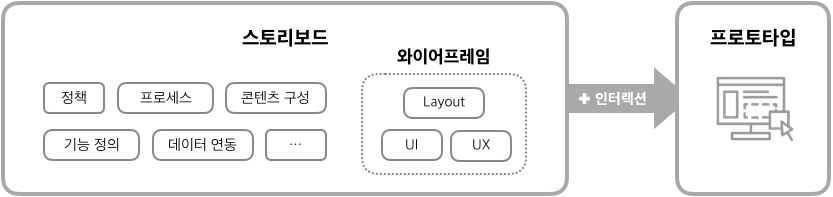
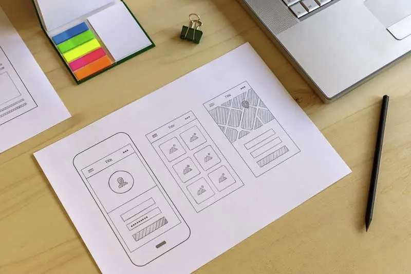
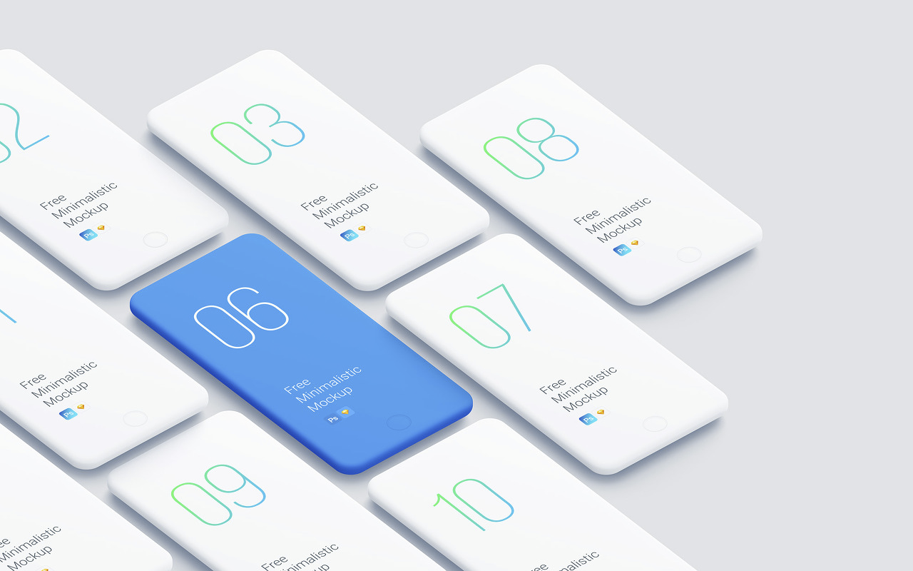
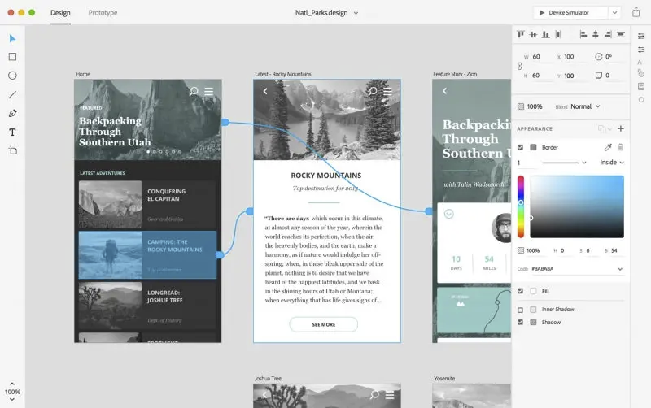

## 스토리보드



### 스토리보드 (동의어 : 화면정의서, 화면설계서, MMI(Man Machine Interface))

디자이너/개발자가 참고하는 최종적인 산출 문서이다.

서비스 구축을 위한 모든 정보가 담겨져있는 문서. 스토리보드를 바탕으로 커뮤니케이션 진행한다.

완성해야할 앱서비스와 예상되는 UX를 미리보기 위한 방법론이다.

구성 :

- 정책

- 프로세스

- 와이어프레임

- 콘텐츠 구성

- 기능 정의

- 데이터 연동
  
    [스토리보드 템플릿](https://www.notion.so/82b0f17301444d1c93b96c762dfe2ca3)

### 와이어프레임 `= 골격`



화면 단위의 레이아웃 설계 작업. 서비스의 간략한 흐름을 공유하기 위함.

큰 틀을 디자인하는데에 집중

툴 : 손그림, 파워포인트, 키노트,스케치,일러스트,포토샵 등

- Layout
- UI
- UX

### 목업



실물과 흡사한 정적인 형태의 모형



실제 서비스와 흡사한 모형을 만듬. 와이어프레임이나 스토리보드에 인터렉션을 적용함으로 실제 구현된 것 처럼 시뮬레이션. 최종 제품을 미들 피델리티에서 하이 피델리티 사이의 품질로 재현한 것으로, 유저 인터페이스의 상호 작용을 시뮬레이션한다.

(더 깊게 견고하게 만들 수 있지만, 최대한 단순하게 처음부터 종료까지 핵심 부분, 흐름에 관련된 동작만을 고려하여 만들어짐)

### 레퍼런스

[https://yslab.kr/94](https://yslab.kr/94)

[https://uxplanet.org/wireframe-mockup-prototype-what-is-what-8cf2966e5a8b](https://uxplanet.org/wireframe-mockup-prototype-what-is-what-8cf2966e5a8b)

[https://blog.adobe.com/ko/publish/2018/03/06/everything-you-need-to-know-about-wireframes-and-prototypes](https://blog.adobe.com/ko/publish/2018/03/06/everything-you-need-to-know-about-wireframes-and-prototypes)

[https://jasontody.tistory.com/210](https://jasontody.tistory.com/210)

[https://cmos00.tistory.com/1984](https://cmos00.tistory.com/1984)

[https://yslab.kr/148](https://yslab.kr/148)

```toc

```